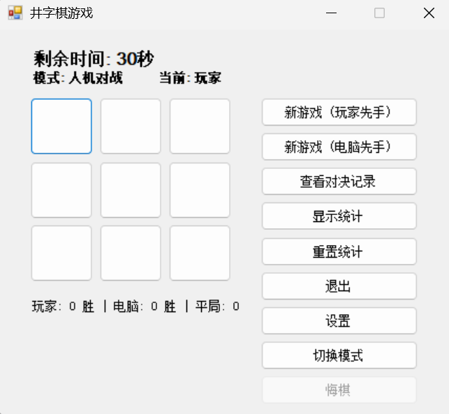

# 井字棋游戏 (Tic-Tac-Toe Game)

一个基于C#和Windows Forms开发的井字棋游戏，支持人机对战、玩家对战、悔棋功能、计时器限制以及游戏记录保存。



## 功能特性

- 🎮 两种游戏模式：人机对战和玩家对战
- ⏰ 计时器功能：每步限时，超时判负
- ↩️ 悔棋功能：支持撤销上一步操作
- 📊 游戏统计：记录胜负平局次数
- 💾 游戏记录：自动保存每局对战详情
- 🎨 用户友好界面：清晰的游戏状态显示

## 技术栈

- **开发语言**: C#
- **框架**: .NET framework 4.7.2
- **UI框架**: Windows Forms
- **数据存储**: 文本文件存储

## 安装与运行

### Prerequisites (依赖项)
- [.NET Framework 4.7.2](https://dotnet.microsoft.com/download/dotnet-framework/net472) 或更高版本
- Windows 操作系统 (支持Windows 7及以上版本)


### Installing (安装流程)
1. 下载项目源代码
2. 使用Visual Studio 2017或更高版本打开解决方案文件(`.sln`)
3. 构建项目：
   - 菜单栏选择"生成" -> "生成解决方案"
4. 运行项目：
   - 按F5键或点击"启动"按钮

或者使用命令行工具：
```bash
msbuild TicTacToe.sln
```


## 运行测试

项目包含以下测试方案：

1. **功能测试**：
   - 测试各种获胜条件(横、竖、对角线)
   - 测试平局情况
   - 测试悔棋功能
   - 测试超时判负功能

2. **界面测试**：
   - 测试界面元素布局和响应
   - 测试游戏状态显示更新

3. **数据持久化测试**：
   - 测试游戏记录是否正确保存和加载
   - 测试统计数据是否正确更新

## 使用说明

### 开始游戏

1. 启动程序后，选择游戏模式：
   - 人机对战：玩家与电脑AI对战
   - 玩家对战：两名玩家在同一设备上轮流操作

2. 选择先手玩家：
   - 在人机模式下可选择玩家先手或电脑先手
   - 在玩家对战模式下可选择玩家1先手或玩家2先手

3. 游戏规则：
   - 玩家需要在3×3的棋盘上放置自己的标记(X或O)
   - 先连成一条直线(横、竖或对角线)的玩家获胜
   - 每步操作有时间限制(默认30秒)，超时判负

### 特殊功能

- **悔棋功能**：点击"悔棋"按钮可以撤销上一步操作
- **游戏设置**：可以调整每步的时间限制(5-120秒)
- **查看记录**：可以浏览以往的游戏记录和统计信息

## API参考

### 主要类和方法

- `MainForm`：主游戏窗体
  - `InitializeGame()`: 初始化游戏状态
  - `BoardButtonClick(int position)`: 处理棋盘点击事件
  - `ComputerMove()`: AI计算下一步移动
  - `CheckWin(char symbol)`: 检查是否获胜
  - `SaveGameResult(string result)`: 保存游戏结果

- `HistoryForm`：历史记录查看窗体
  - `LoadGameFiles()`: 加载游戏记录文件

- `SettingsForm`：设置窗体
  - 允许用户调整游戏时间限制

## 贡献指南

欢迎提交Issue和Pull Request来改进这个项目。

1. Fork本项目
2. 创建特性分支 (`git checkout -b feature/AmazingFeature`)
3. 提交更改 (`git commit -m 'Add some AmazingFeature'`)
4. 推送到分支 (`git push origin feature/AmazingFeature`)
5. 开启Pull Request

## 版本历史

- **v1.0** 
  - 初始版本发布
  - 实现基本井字棋游戏功能
  - 添加人机对战模式

- **v1.1** 
  - 添加对局记录

- **v1.2** 
  - 增加计时器

- **v1.3** 
  - 增加玩家对战
  - 增加悔棋功能

## 作者

- **单鹏安** - 初始工作 - [Spa050816](https://github.com/Spa050816)
- **戴彻饶** - 增加对局记录 - [Anchorage21](https://github.com/Anchorage21)
- **薛煜川** -  - []()
- **靳翔** -  - []()

## 致谢

- 感谢.NET团队提供的优秀开发框架
- 感谢所有测试人员和反馈者
- 灵感来源于经典井字棋游戏

---


如有问题或建议，请提交Issue或联系开发者。
